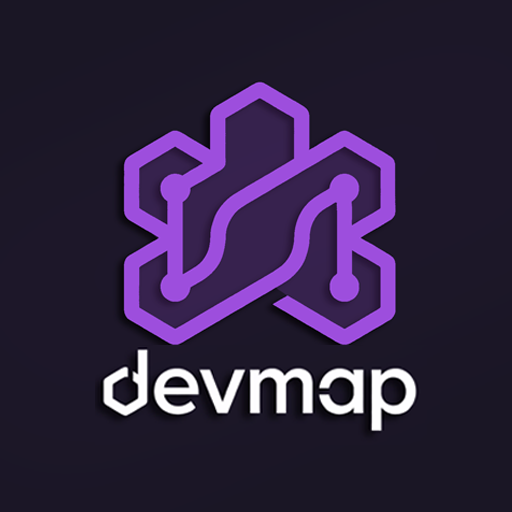

<p align="center">
  
</p>

<h1 align="center">DevMap</h1>

<p align="center">
  Sistema desktop offline para gerenciar projetos, APIs, repositórios e bancos de dados de forma centralizada.
</p>

<p align="center">
  
  
  
  
  
</p>

---

## 📌 Sobre o Projeto

**DevMap** é uma aplicação desktop totalmente offline, construída com Electron, que centraliza o gerenciamento de tudo que um desenvolvedor precisa acompanhar no dia a dia:

- ✅ **Projetos** — crie e gerencie projetos com status, responsável e datas
- 🔌 **APIs / Endpoints** — documente as rotas de cada projeto (método, rota, controller)
- 🗄️ **Bancos de Dados** — registre conexões e configurações de banco por projeto
- 🐙 **Repositórios** — vincule repositórios GitHub com stack e observações
- 📋 **Tasks** — acompanhe tarefas internas por projeto

Toda a informação fica armazenada localmente em um banco SQLite, sem depender de nenhum serviço externo.

---

## 🧱 Stack

### 🖥️ Frontend
| Tecnologia | Uso |
|---|---|
| [React 19](https://react.dev/) | Interface do usuário |
| [TypeScript](https://www.typescriptlang.org/) | Tipagem estática |
| [Vite](https://vitejs.dev/) | Bundler e dev server |
| [React Router DOM v7](https://reactrouter.com/) | Roteamento |
| [Axios](https://axios-http.com/) | Requisições HTTP |
| CSS Vanilla | Estilização com variáveis de design próprias |

### ⚙️ Backend
| Tecnologia | Uso |
|---|---|
| [Express 5](https://expressjs.com/) | API REST local |
| [TypeScript](https://www.typescriptlang.org/) | Tipagem estática |
| [better-sqlite3](https://github.com/WiseLibs/better-sqlite3) | Banco de dados SQLite local |
| [ts-node-dev](https://github.com/wclr/ts-node-dev) | Hot reload em desenvolvimento |

### 🖱️ Desktop
| Tecnologia | Uso |
|---|---|
| [Electron](https://www.electronjs.org/) | Empacotamento desktop (Windows, macOS, Linux) |

---

## 📁 Estrutura do Projeto

```
devmap/
├── electron/          # Configuração do Electron (main process)
├── frontend/          # Aplicação React (Vite + TypeScript)
│   └── src/
│       ├── components/    # Componentes reutilizáveis (Modal, Cards, Form, Icons)
│       ├── models/        # Interfaces TypeScript
│       ├── pages/         # Páginas da aplicação
│       ├── services/      # Camada de acesso à API
│       └── styles/        # CSS global e por componente
├── backend/           # API Express (TypeScript)
│   └── src/
│       ├── controllers/   # Lógica de cada rota
│       ├── database/      # Conexão e migrations SQLite
│       ├── models/        # Interfaces do banco
│       └── routes/        # Definição de rotas
└── devmap.db          # Banco de dados SQLite (gerado automaticamente)
```

---

## 🚀 Como rodar localmente

### Pré-requisitos
- [Node.js](https://nodejs.org/) v18+
- npm

### 1. Clone o repositório
```bash
git clone https://github.com/lukinhasc-dev/devmap.git
cd devmap
```

### 2. Instale as dependências
```bash
# Raiz (Electron)
npm install

# Backend
cd backend && npm install

# Frontend
cd ../frontend && npm install
```

### 3. Inicie o backend
```bash
cd backend
npm run dev
```
> A API sobe em `http://localhost:3000`

### 4. Inicie o frontend
```bash
cd frontend
npm run dev
```
> O Vite sobe em `http://localhost:5173`

### 5. (Opcional) Inicie o Electron
```bash
# Na raiz do projeto
npm start
```

---

## 📥 Download

> 🚧 **Em breve!**

O DevMap será disponibilizado como um instalador nativo — sem necessidade de clonar o repositório, instalar Node.js ou configurar nada manualmente.

Basta baixar o executável para o seu sistema operacional e começar a usar:

| Plataforma | Formato |
|---|---|
| Windows | `.exe` (instalador) |
| macOS | `.dmg` |
| Linux | `.AppImage` |

Fique de olho nas [Releases do GitHub](https://github.com/lukinhasc-dev/devmap/releases) para acompanhar quando estiver disponível.

---

## �📄 Licença

Distribuído sob a licença MIT. Veja [`LICENSE`](./LICENSE) para mais informações.

---

<p align="center">Feito com ☕ por <a href="https://github.com/lukinhasc-dev">Lukinhas</a></p>
